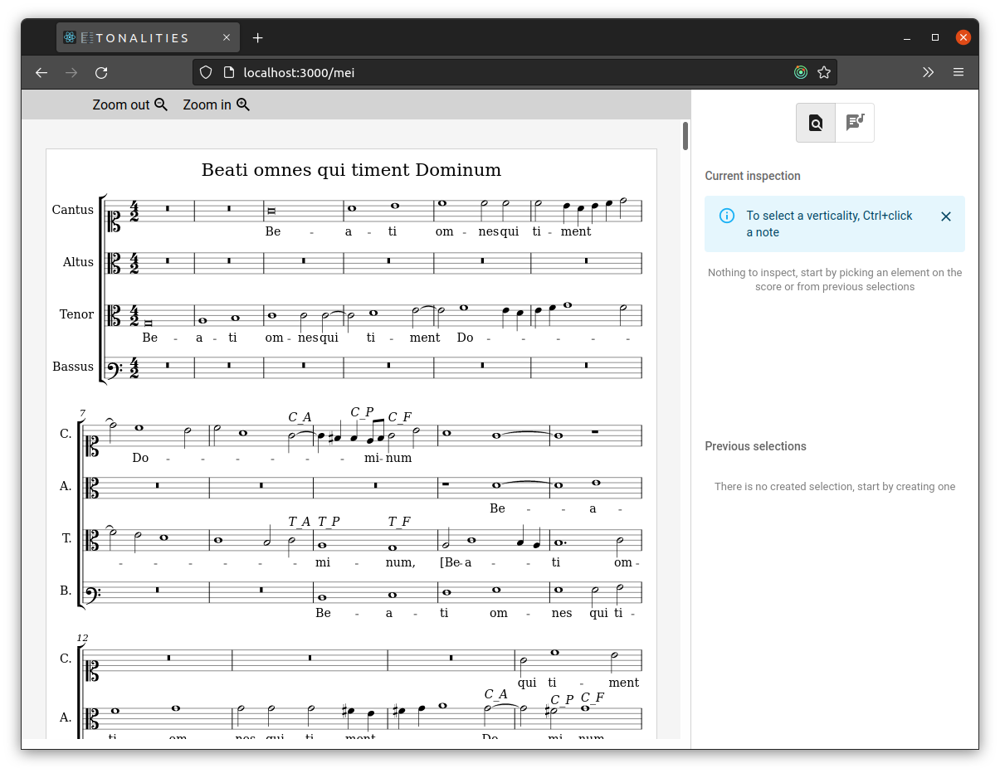
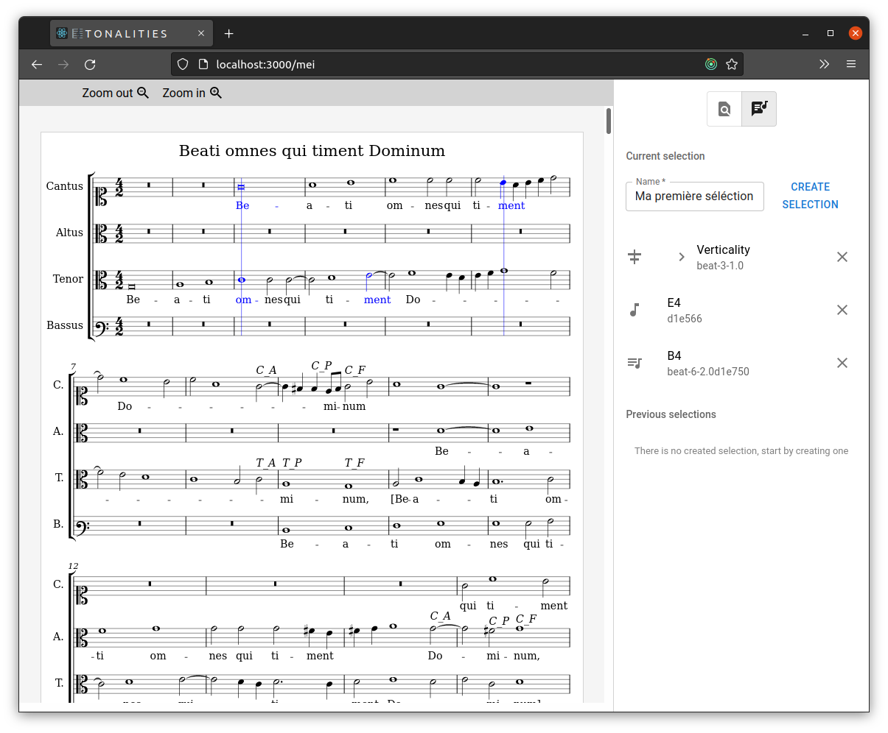
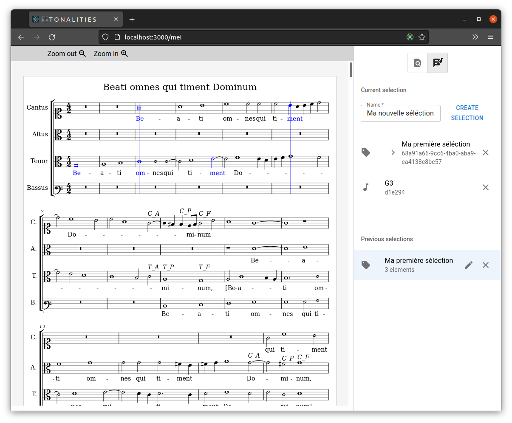

# Interface d'adressage
- La partition sélectionnée à gauche
- Le panneau latéral à droite

# Deux modes d'interaction complémentaires
- Le mode **inspection** permet de cibler un élément particulier et de consulter ses métadonnées
- Le mode **sélection** permet de constituer un groupe d'éléments

# Trois types d'élements unitaires à sélectionner ou à inspecter sur une partition
- Une **note** (unité structurelle)
- Une **verticalité** (unité temporelle)
- Une **note positionnée** (conjonction d'une note et d'une verticalité)

# Des sélections modifiables et réemployables
Les sélections regroupent des composants de la partition mais peuvent aussi réemployer des sélections déjà existantes.

# À venir
- À partir de ces sélections il sera possible de créer des **annotations**, c'est à dire
	- dire quelque-chose à propos des éléments séléctionnnés...
	- ...dans des termes provenant d'un modèle théorique spécifique
